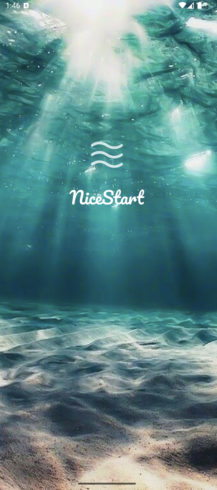
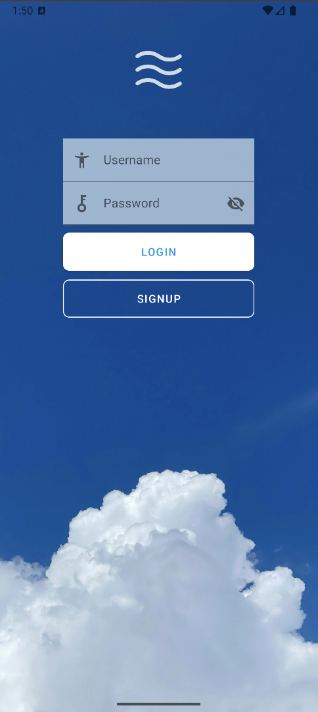
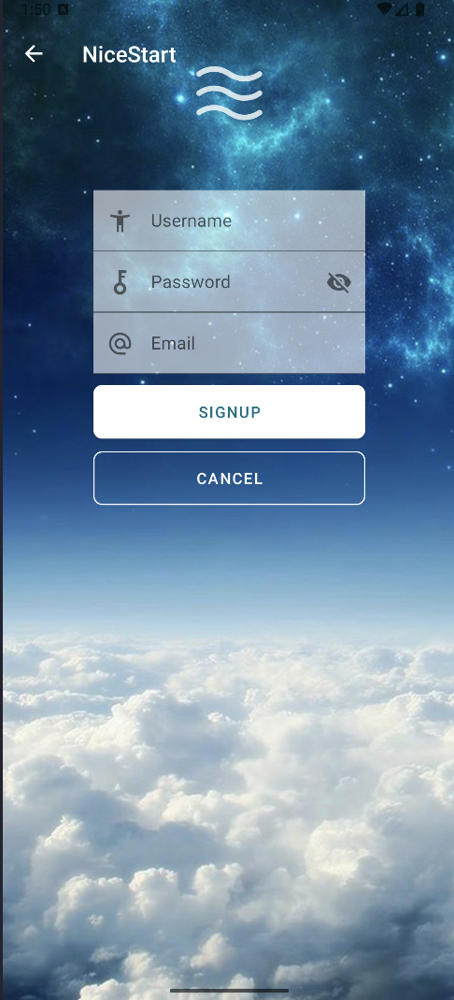

## Introduction to NICESTART, got some stuff to check out ##

This **repository** is used to store constant updates on my first UI design class.

**Splash view**

**Old Login view**

**New Login with image**

**Old Signup view**

**New Signup with image**

>This project is under creative commons
>[Creativecommons Org Licensed By Sa 4](https://creativecommons.org/licenses/by-sa/4.0)