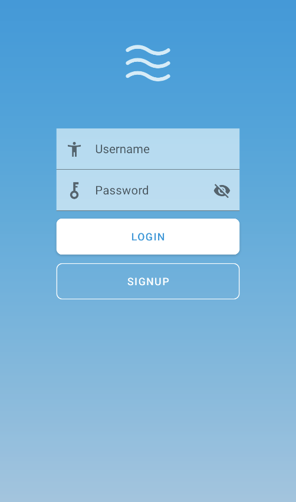
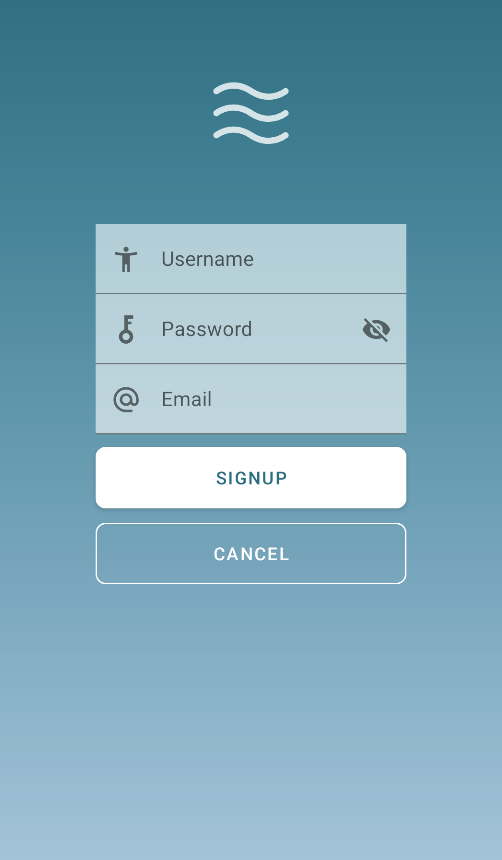

## Introduction to NICESTART, got some stuff to check out ##

This **repository** is used to store constant updates on my first UI design class.

**Login view**

**Signup view**

>This project is under creative commons
>[Creativecommons Org Licensed By Sa 4](https://creativecommons.org/licenses/by-sa/4.0)