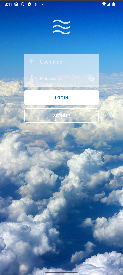
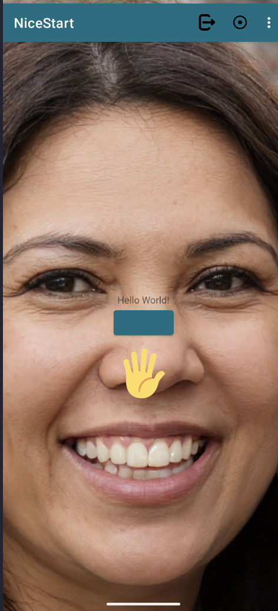
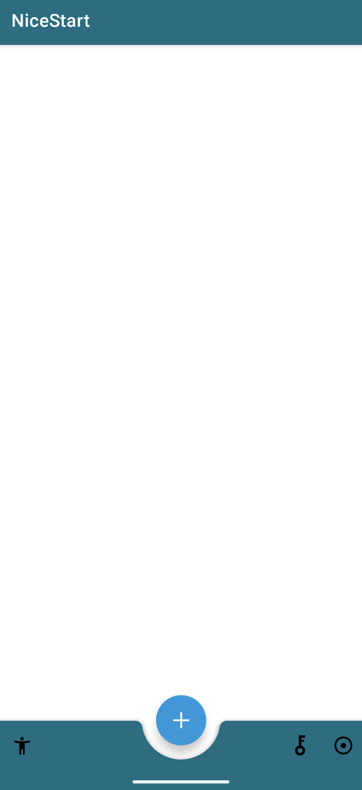

# NICESTART, my first steps

## This **repository** is used to store constant updates on my first UI design class.

The first thing we started off with this project were the Splash, Login and SignUp screens
These are updated versions with a glide background, they used to have a gradient background.

<p>
    
    
    
</p>

After that, we added a **profile page**
<p>
    
</p>

Plus some features on the **main activity** view:
```
Context Menu
App bar
Settings and Copy Toast
Slide Refresh with an Undo option
Log off button
WebView
```

<p>
    
    
    
    
    
</p>

**New Log off option with a custom view dialog**


**Added a WebView visor por background images**


**Added internationalization**


**Added a dark theme**


**Added a bottom app bar**

>This project is under creative commons
>[Creativecommons Org Licensed By Sa 4](https://creativecommons.org/licenses/by-sa/4.0)