## Introduction to NICESTART, got some stuff to check out ##

This **repository** is used to store constant updates on my first UI design class.

**Splash view**

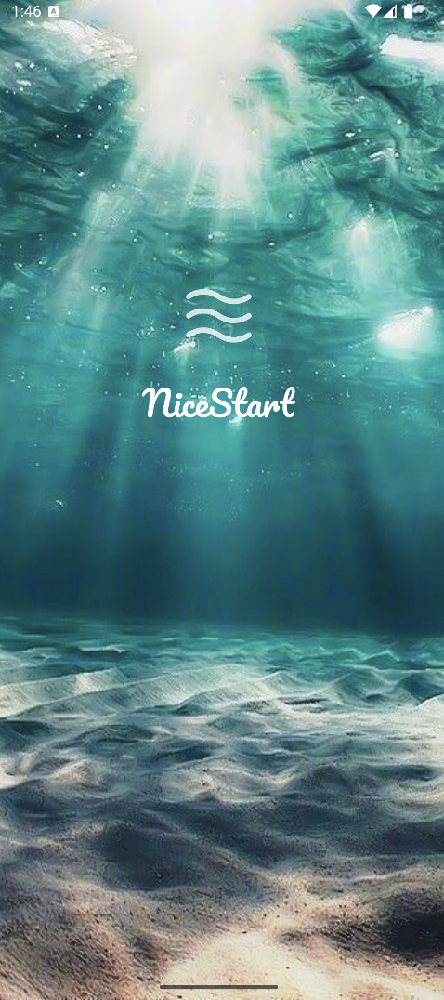

**Login**

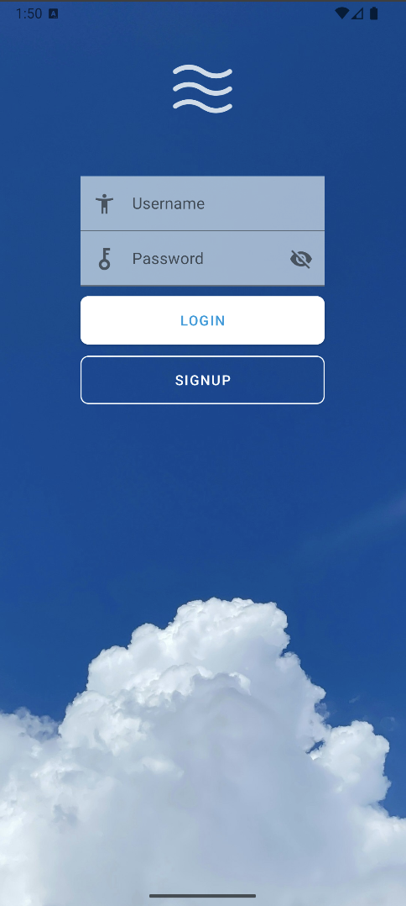

**Signup**

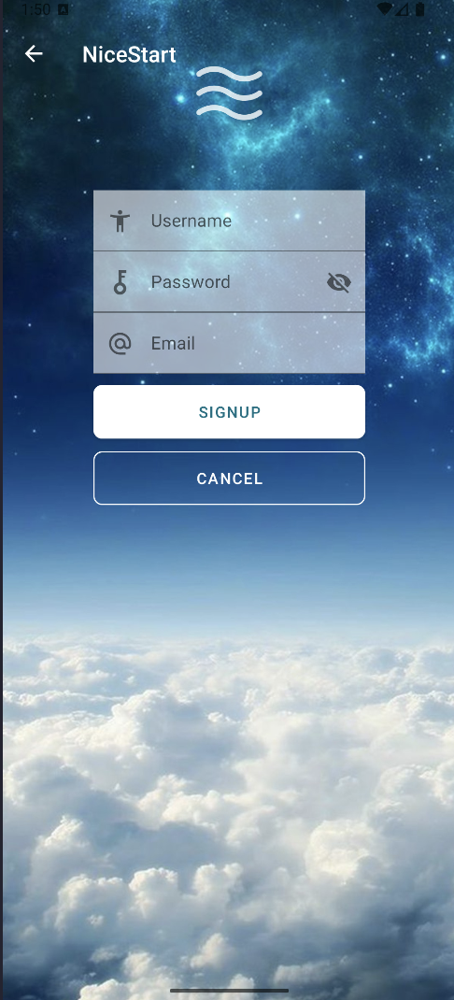

**Added a profile page, plus some features on the main activity view**

**Profile**
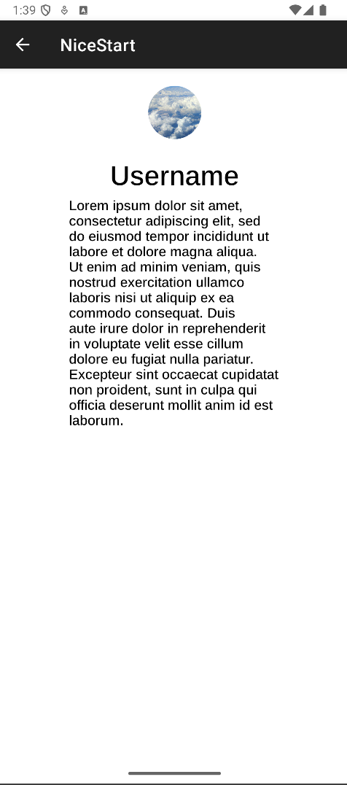

**Context Menu**
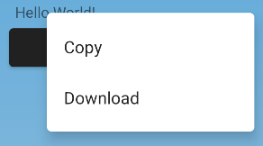

**App bar**

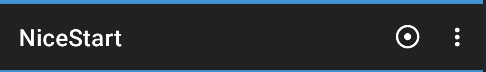

**Settings Toast when pressed on the settings symbol**
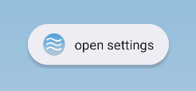

**Copy Context menu when pressing on the 3 dots**
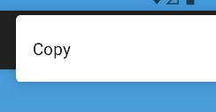

**SlideRefresh with Snackbar**
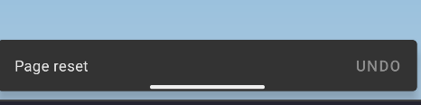

**Undo the Snackbar's refresh**
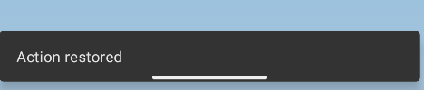

**New Log off option with a custom view dialog**
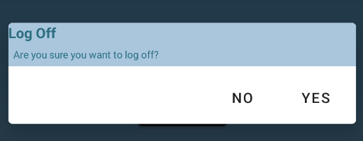

**Added a WebView visor por background images**
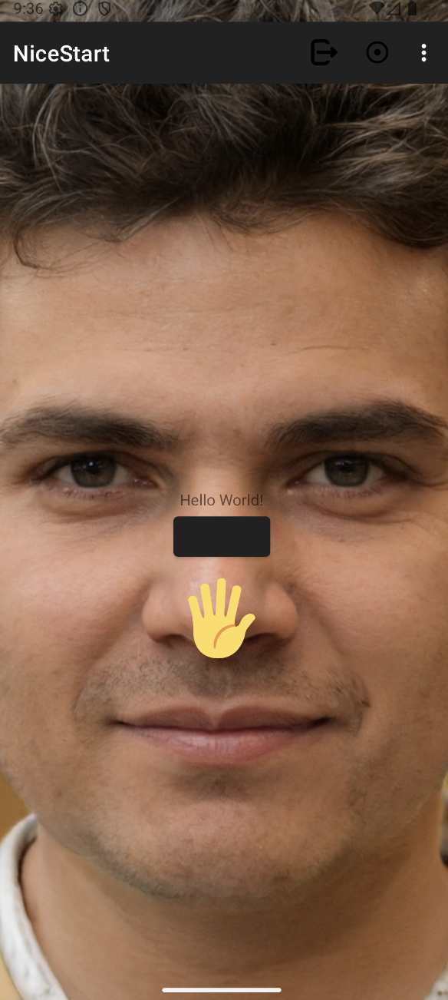

**Added internationalization**
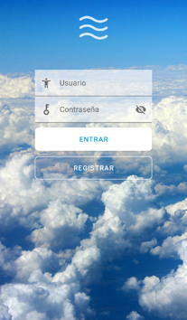
>This project is under creative commons
>[Creativecommons Org Licensed By Sa 4](https://creativecommons.org/licenses/by-sa/4.0)